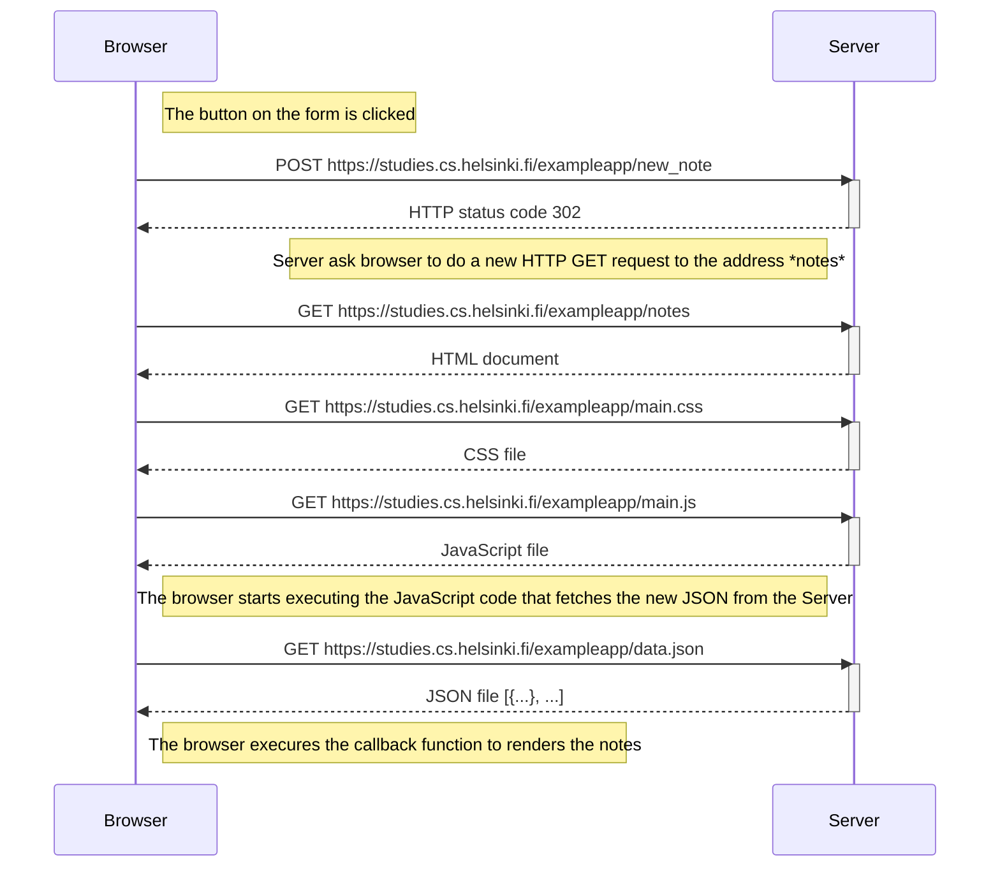

```mermaid
sequenceDiagram
    participant Browser
    participant Server

    Note right of Browser: The button on the form is clicked

    Browser->>Server: POST https://studies.cs.helsinki.fi/exampleapp/new_note
    activate Server
    Server-->>Browser: HTTP status code 302
    deactivate Server

    Note left of Server: Server ask browser to do a new HTTP GET request to the address *notes*

    Browser->>Server: GET https://studies.cs.helsinki.fi/exampleapp/notes
    activate Server
    Server-->>Browser: HTML document
    deactivate Server

    Browser->>Server: GET https://studies.cs.helsinki.fi/exampleapp/main.css
    activate Server
    Server-->>Browser: CSS file
    deactivate Server

    Browser->>Server: GET https://studies.cs.helsinki.fi/exampleapp/main.js
    activate Server
    Server-->>Browser: JavaScript file
    deactivate Server

    Note right of Browser: The browser starts executing the JavaScript code that fetches the new JSON from the Server

    Browser->>Server: GET https://studies.cs.helsinki.fi/exampleapp/data.json
    activate Server
    Server-->>Browser: JSON file [{...}, ...]
    deactivate Server

    Note right of Browser: The browser execures the callback function to renders the notes

```
