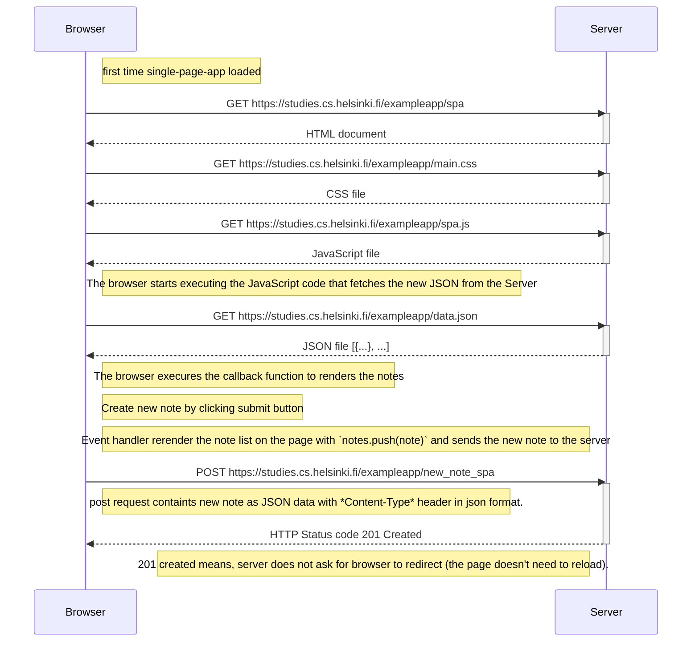

```mermaid
sequenceDiagram
    participant Browser
    participant Server

    Note right of Browser: first time single-page-app loaded

    Browser->>Server: GET https://studies.cs.helsinki.fi/exampleapp/spa
    activate Server
    Server-->>Browser: HTML document
    deactivate Server

    Browser->>Server: GET https://studies.cs.helsinki.fi/exampleapp/main.css
    activate Server
    Server-->>Browser: CSS file
    deactivate Server

    Browser->>Server: GET https://studies.cs.helsinki.fi/exampleapp/spa.js
    activate Server
    Server-->>Browser: JavaScript file
    deactivate Server

    Note right of Browser: The browser starts executing the JavaScript code that fetches the new JSON from the Server

    Browser->>Server: GET https://studies.cs.helsinki.fi/exampleapp/data.json
    activate Server
    Server-->>Browser: JSON file [{...}, ...]
    deactivate Server

    Note right of Browser: The browser execures the callback function to renders the notes

    Note right of Browser: Create new note by clicking submit button

    Note right of Browser: Event handler rerender the note list on the page with `notes.push(note)` and sends the new note to the server

    Browser->>Server: POST https://studies.cs.helsinki.fi/exampleapp/new_note_spa
    activate Server

    Note right of Browser: post request containts new note as JSON data with *Content-Type* header in json format.

    Server-->>Browser: HTTP Status code 201 Created
    deactivate Server

    Note left of Server: 201 created means, server does not ask for browser to redirect (the page doesn't need to reload).
```
